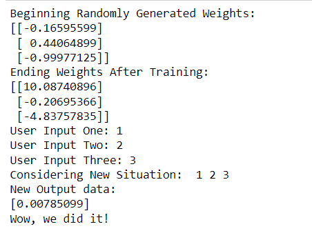

### EX NO : 05
### DATE  :
# <p align="center"> SIGMOID-ACTIVATION-FUNCTION </p>
## Aim:
  To develop a python code that creates a simple feed-forward neural networks or perception with the Sigmoid activation function. The neuron has to be trained such that it can predict the correct output value when provided with a new set of input data.
  
 

## Equipments Required:
1. Hardware – PCs
2. Anaconda – Python 3.7 Installation / Moodle-Code Runner / Google Colab

## Related Theoritical Concept:


## Algorithm
1. Import packages.
2. Define neural network class.
3. Model single neuron with 3 inputs and 1 output and assign random weights to a 3 x 1 matrix with values between -1 and 1.
4. Define sigmoid function and calculate the error.
5. Multiply the error by the input and again by the gradient of the sigmoid curve.
6. Initialize a single neuron neural network.
7. Train neural network using training data.
8. Test neural network with new data.

## Program:
```
Program to implement the sigmoid activation function in a feed forward ANN.
Developed by: SOUVIK KUNDU 
RegisterNumber: 212221230105 


import numpy as np
class NeuralNetwork():
    
    def __init__(self):
        # seeding for random number generation
        np.random.seed(1)
        
        #converting weights to a 3 by 1 matrix with values from -1 to 1 and mean of 0
        self.synaptic_weights = 2 * np.random.random((3, 1)) - 1

    def sigmoid(self, x):
        #applying the sigmoid function
        return 1 / (1 + np.exp(-x))

    def sigmoid_derivative(self, x):
        #computing derivative to the Sigmoid function
        return x * (1 - x)

    def train(self, training_inputs, training_outputs, training_iterations):
        
        #training the model to make accurate predictions while adjusting weights continually
        for iteration in range(training_iterations):
            #siphon the training data via  the neuron
            output = self.think(training_inputs)

            #computing error rate for back-propagation
            error = training_outputs - output
            
            #performing weight adjustments
            adjustments = np.dot(training_inputs.T, error * self.sigmoid_derivative(output))

            self.synaptic_weights += adjustments

    def think(self, inputs):
        #passing the inputs via the neuron to get output   
        #converting values to floats
        
        inputs = inputs.astype(float)
        output = self.sigmoid(np.dot(inputs, self.synaptic_weights))
        return output


if __name__ == "__main__":

    #initializing the neuron class
    neural_network = NeuralNetwork()

    print("Beginning Randomly Generated Weights: ")
    print(neural_network.synaptic_weights)

    #training data consisting of 4 examples--3 input values and 1 output
    training_inputs = np.array([[0,0,1],
                                [1,1,1],
                                [1,0,1],
                                [0,1,1]])

    training_outputs = np.array([[0,1,1,0]]).T

    #training taking place
    neural_network.train(training_inputs, training_outputs, 15000)

    print("Ending Weights After Training: ")
    print(neural_network.synaptic_weights)

    user_input_one = str(input("User Input One: "))
    user_input_two = str(input("User Input Two: "))
    user_input_three = str(input("User Input Three: "))
    
    print("Considering New Situation: ", user_input_one, user_input_two, user_input_three)
    print("New Output data: ")
    print(neural_network.think(np.array([user_input_one, user_input_two, user_input_three])))
    print("Wow, we did it!")

```

## Output:



## Result:
  Thus created a perception to employ the Sigmoid activation function. This neuron was successfully trained to predict the correct output value, when provided with a new set of input data.
